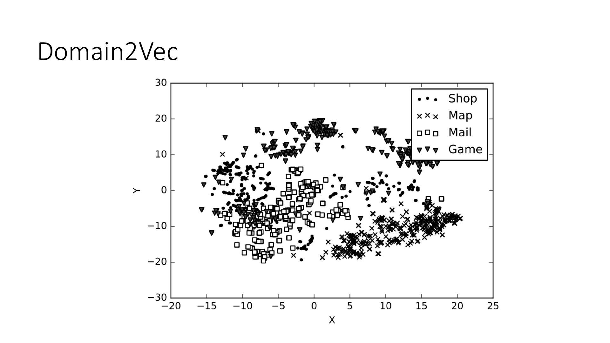
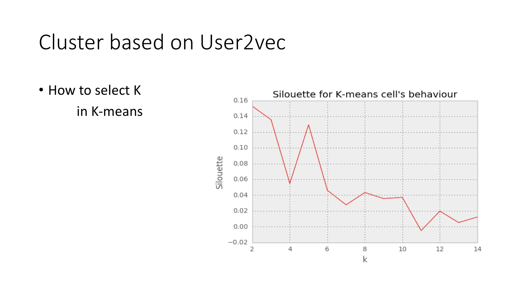

# [Click to See Domain2Vec Demo](http://projector.tensorflow.org/?config=https://gist.githubusercontent.com/jiangwaniot/bab2f35b527a439ccdae2fce3ffdc536/raw/5c787e1543a9c3a8303e5a19cfebbf2d6f26782b/config.json)

<figure>

</figure>
<figure>

</figure>