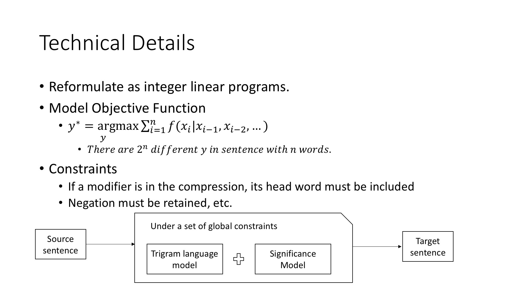
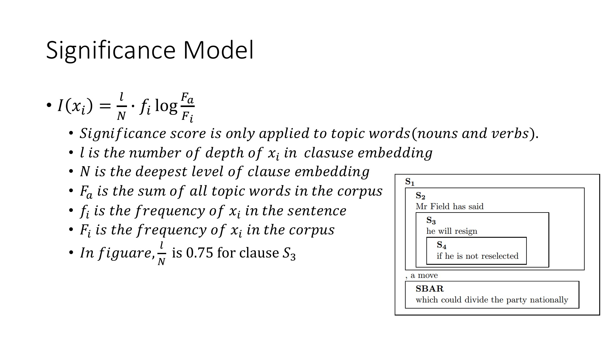

<figure>
	
</figure>

<figure>

</figure>

<figure>
	
</figure>

<figure>
	
</figure>

<figure>
	
</figure>

<figure>
	
</figure>

<figure>
	
</figure>

<figure>
	
</figure>

<figure>
	
</figure>

<figure>
	
</figure>

<figure>
	
</figure>
