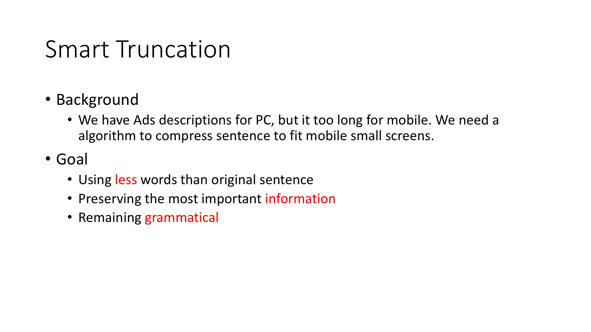

# 基于整数线性规划的句子压缩算法研究

---
layout: post
title: "A Post with Images"
excerpt: "Examples and code for displaying images in posts."
categories: articles
tags: [sample-post, images, test]
comments: true
share: true
---

<figure>
	
	<figcaption><a href="http://www.flickr.com/photos/80901381@N04/7758832526/" title="Morning Fog Emerging From Trees by A Guy Taking Pictures, on Flickr">Morning Fog Emerging From Trees by A Guy Taking Pictures, on Flickr</a>.</figcaption>
</figure>

## Goal
- Using **less** words than original sentence
- Preserving the most important **information**
- Remaining **grammatical**

## Model Object Function

